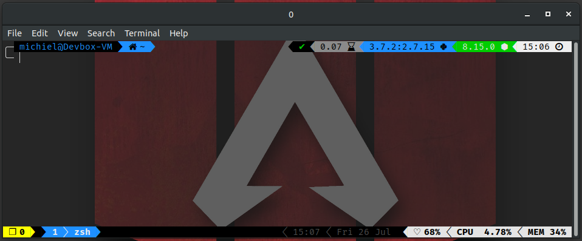
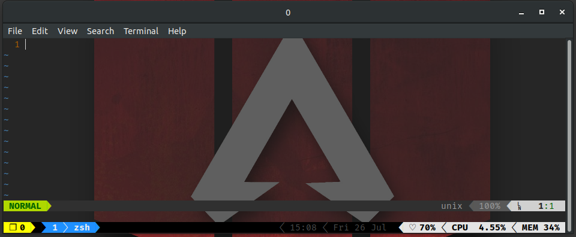
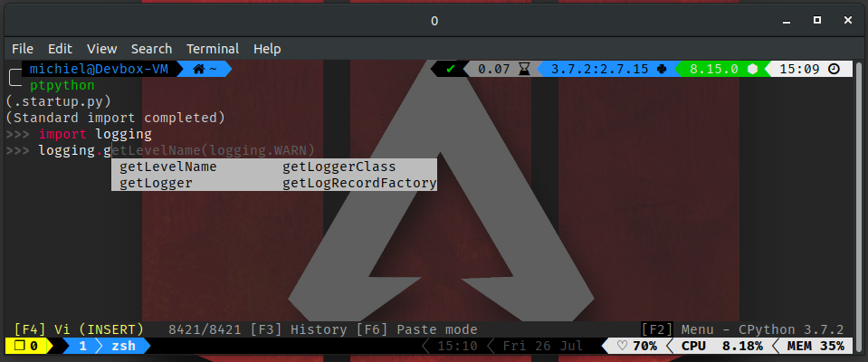
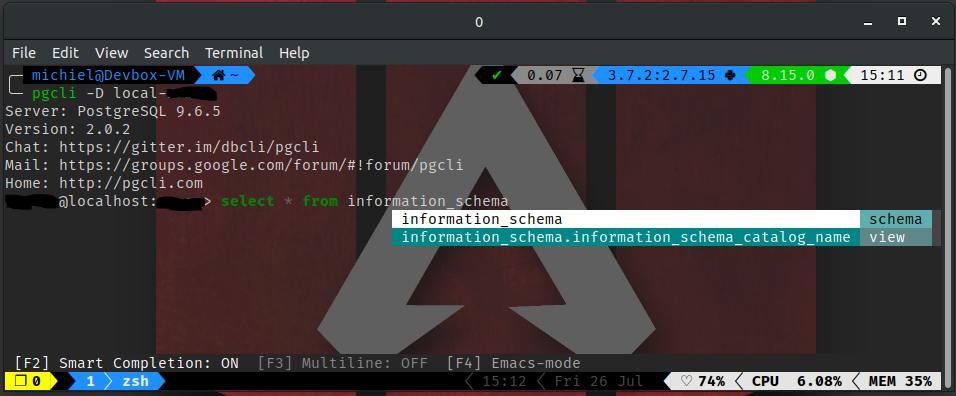

# System_config

Holds my system configuration files

## Screenshots

### ZSH and TMUX

### VIM

### PtPython

### PgCli

## ZSH

Install with `install_zsh.sh`.
Will load `~/.export` and `~/.alias` automatically if they exist.
I use these to store my exports and aliasses instead of adding them to `~/.zshrc` directly. This allows me to pull down new versions without breaking local config.

## Links

### Virtual Environments

* [goenv](https://github.com/syndbg/goenv)
* [nvm](https://github.com/nvm-sh/nvm)
* [pyenv](https://github.com/pyenv/pyenv)
* [rbenv](https://github.com/rbenv/rbenv)

### Tools and customization

* [ammonite-repl](https://ammonite.io/#Ammonite-REPL)
* [antigen](https://github.com/zsh-users/antigen)
* [colorls](https://github.com/athityakumar/colorls)
* [Oh My Zsh](https://ohmyz.sh/)
* [nerdfonts](https://www.nerdfonts.com) - Fira Code
* [pgcli](https://github.com/dbcli/pgcli)
* [Powerlevel9k](https://github.com/Powerlevel9k/powerlevel9k)
* [psql-pager](https://github.com/kyokley/psql-pager)
* [ptpython](https://github.com/prompt-toolkit/ptpython)
* [tpm](https://github.com/tmux-plugins/tpm)
